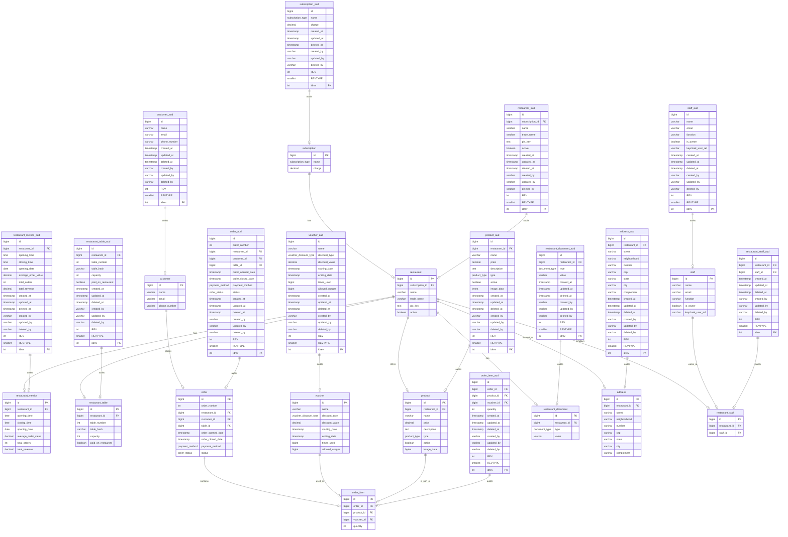

### Tables Explanation

Every single table has an audit table associated with it to keep track of every single change of the entities.

```mermaid
erDiagram
    subscription {
        bigint id PK
        subscription_type name
        decimal charge
    }

    subscription_aud {
        bigint id
        subscription_type name
        decimal charge
        timestamp created_at
        timestamp updated_at
        timestamp deleted_at
        varchar created_by
        varchar updated_by
        varchar deleted_by
        int REV
        smallint REVTYPE
        int idrev PK
    }

    customer {
        bigint id PK
        varchar name
        varchar email
        varchar phone_number
    }

    customer_aud {
        bigint id
        varchar name
        varchar email
        varchar phone_number
        timestamp created_at
        timestamp updated_at
        timestamp deleted_at
        varchar created_by
        varchar updated_by
        varchar deleted_by
        int REV
        smallint REVTYPE
        int idrev PK
    }

    restaurant {
        bigint id PK
        bigint subscription_id FK
        varchar name
        varchar trade_name
        text pix_key
        boolean active
    }

    restaurant_aud {
        bigint id
        bigint subscription_id FK
        varchar name
        varchar trade_name
        text pix_key
        boolean active
        timestamp created_at
        timestamp updated_at
        timestamp deleted_at
        varchar created_by
        varchar updated_by
        varchar deleted_by
        int REV
        smallint REVTYPE
        int idrev PK
    }

    restaurant_metrics {
        bigint id PK
        bigint restaurant_id FK
        time opening_time
        time closing_time
        date opening_date
        decimal average_order_value
        int total_orders
        decimal total_revenue
    }

    restaurant_metrics_aud {
        bigint id
        bigint restaurant_id FK
        time opening_time
        time closing_time
        date opening_date
        decimal average_order_value
        int total_orders
        decimal total_revenue
        timestamp created_at
        timestamp updated_at
        timestamp deleted_at
        varchar created_by
        varchar updated_by
        varchar deleted_by
        int REV
        smallint REVTYPE
        int idrev PK
    }

    restaurant_table {
        bigint id PK
        bigint restaurant_id FK
        int table_number
        varchar table_hash
        int capacity
        boolean paid_on_restaurant
    }

    restaurant_table_aud {
        bigint id
        bigint restaurant_id FK
        int table_number
        varchar table_hash
        int capacity
        boolean paid_on_restaurant
        timestamp created_at
        timestamp updated_at
        timestamp deleted_at
        varchar created_by
        varchar updated_by
        varchar deleted_by
        int REV
        smallint REVTYPE
        int idrev PK
    }

    product {
        bigint id PK
        bigint restaurant_id FK
        varchar name
        decimal price
        text description
        product_type type
        boolean active
        bytea image_data
    }

    product_aud {
        bigint id
        bigint restaurant_id FK
        varchar name
        decimal price
        text description
        product_type type
        boolean active
        bytea image_data
        timestamp created_at
        timestamp updated_at
        timestamp deleted_at
        varchar created_by
        varchar updated_by
        varchar deleted_by
        int REV
        smallint REVTYPE
        int idrev PK
    }

    order {
        bigint id PK
        int order_number
        bigint restaurant_id FK
        bigint customer_id FK
        bigint table_id FK
        timestamp order_opened_date
        timestamp order_closed_date
        payment_method payment_method
        order_status status
    }

    order_aud {
        bigint id
        int order_number
        bigint restaurant_id FK
        bigint customer_id FK
        bigint table_id FK
        timestamp order_opened_date
        timestamp order_closed_date
        payment_method payment_method
        order_status status
        timestamp created_at
        timestamp updated_at
        timestamp deleted_at
        varchar created_by
        varchar updated_by
        varchar deleted_by
        int REV
        smallint REVTYPE
        int idrev PK
    }

    voucher {
        bigint id PK
        varchar name
        voucher_discount_type discount_type
        decimal discount_value
        timestamp starting_date
        timestamp ending_date
        bigint times_used
        bigint allowed_usages
    }

    voucher_aud {
        bigint id
        varchar name
        voucher_discount_type discount_type
        decimal discount_value
        timestamp starting_date
        timestamp ending_date
        bigint times_used
        bigint allowed_usages
        timestamp created_at
        timestamp updated_at
        timestamp deleted_at
        varchar created_by
        varchar updated_by
        varchar deleted_by
        int REV
        smallint REVTYPE
        int idrev PK
    }

    order_item {
        bigint id PK
        bigint order_id FK
        bigint product_id FK
        bigint voucher_id FK
        int quantity
    }

    order_item_aud {
        bigint id
        bigint order_id FK
        bigint product_id FK
        bigint voucher_id FK
        int quantity
        timestamp created_at
        timestamp updated_at
        timestamp deleted_at
        varchar created_by
        varchar updated_by
        varchar deleted_by
        int REV
        smallint REVTYPE
        int idrev PK
    }

    restaurant_document {
        bigint id PK
        bigint restaurant_id FK
        document_type type
        varchar value
    }

    restaurant_document_aud {
        bigint id
        bigint restaurant_id FK
        document_type type
        varchar value
        timestamp created_at
        timestamp updated_at
        timestamp deleted_at
        varchar created_by
        varchar updated_by
        varchar deleted_by
        int REV
        smallint REVTYPE
        int idrev PK
    }

    address {
        bigint id PK
        bigint restaurant_id FK
        varchar street
        varchar neighborhood
        varchar number
        varchar cep
        varchar state
        varchar city
        varchar complement
    }

    address_aud {
        bigint id
        bigint restaurant_id FK
        varchar street
        varchar neighborhood
        varchar number
        varchar cep
        varchar state
        varchar city
        varchar complement
        timestamp created_at
        timestamp updated_at
        timestamp deleted_at
        varchar created_by
        varchar updated_by
        varchar deleted_by
        int REV
        smallint REVTYPE
        int idrev PK
    }

    staff {
        bigint id PK
        varchar name
        varchar email
        varchar function
        boolean is_owner
        varchar keycloak_user_ref
    }

    staff_aud {
        bigint id
        varchar name
        varchar email
        varchar function
        boolean is_owner
        varchar keycloak_user_ref
        timestamp created_at
        timestamp updated_at
        timestamp deleted_at
        varchar created_by
        varchar updated_by
        varchar deleted_by
        int REV
        smallint REVTYPE
        int idrev PK
    }

    restaurant_staff {
        bigint id PK
        bigint restaurant_id FK
        bigint staff_id FK
    }

    restaurant_staff_aud {
        bigint id
        bigint restaurant_id FK
        bigint staff_id FK
        timestamp created_at
        timestamp updated_at
        timestamp deleted_at
        varchar created_by
        varchar updated_by
        varchar deleted_by
        int REV
        smallint REVTYPE
        int idrev PK
    }

    %% Relationships
    subscription ||--o| restaurant : "has"
    restaurant ||--o| restaurant_table : "has"
    restaurant ||--o| product : "offers"
    restaurant ||--o| restaurant_staff : "employs"
    restaurant ||--o| restaurant_document : "has"
    restaurant ||--o| address : "located_at"
    restaurant ||--o| restaurant_metrics : "has"
    customer ||--o| order : "places"
    order ||--o| order_item : "contains"
    voucher ||--o| order_item : "used_in"
    product ||--o| order_item : "is_part_of"
    staff ||--o| restaurant_staff : "works_at"

    subscription_aud ||--o| subscription : "audits"
    customer_aud ||--o| customer : "audits"
    restaurant_aud ||--o| restaurant : "audits"
    restaurant_metrics_aud ||--o| restaurant_metrics : "audits"
    restaurant_table_aud ||--o| restaurant_table : "audits"
    product_aud ||--o| product : "audits"
    order_aud ||--o| order : "audits"
    voucher_aud ||--o| voucher : "audits"
    order_item_aud ||--o| order_item : "audits"
    restaurant_document_aud ||--o| restaurant_document : "audits"
    address_aud ||--o| address : "audits"
    staff_aud ||--o| staff : "audits"
    restaurant_staff_aud ||--o| restaurant_staff : "audits"
```
